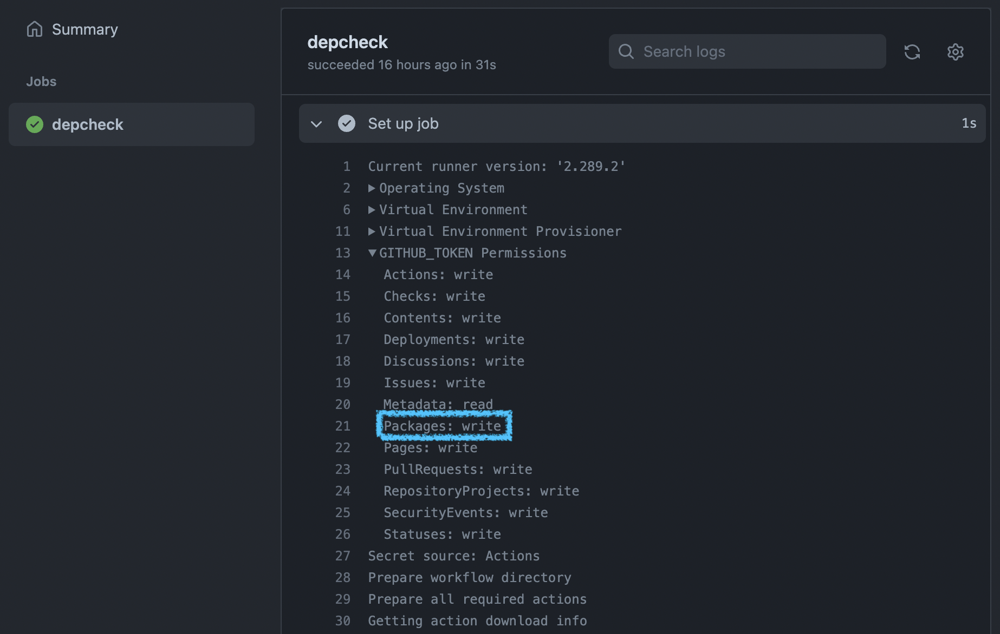

<!-- _class: lead -->
# GitHub NPM Registry

## Use GitHub as package registry for your private packages


---
# Why?

- separation of concerns: split projects into one-purpose only module(s)
- cheap: github package registry is already included in paid accounts
- effortless: almost zero administration & maintenance of registry required

---
<!-- _class: lead invert -->
# Scopes

- Some package names also have a scope
- A scope follows the usual rules for package names. When used in package names, scopes are preceded by an "@" symbol and followed by a slash, e.g.
- Scopes are usually used company-wide

```
@scopename/somepackagename
```

---
<!-- _class: lead invert -->
# Checklist

- package name contains a scope which matches the GitHub organization / username name (lowercased)
- npm config set GitHub registry URL for specific scope(s)
- properly setup of NPM_TOKEN

---
## Package Name

The package’s "scope" must match the organisation’s name:

`package.json`
```json
{
    "name": "@egoditor/somepackagename"
}
```

Name is lowercased cause naming convention doesn’t allow uppercase letters.

---
## Registry

Configure `npm` to use a different package registry URL for specific scope(s).
*Note that the Organisation’s name must exact match here*. **Do not lowercase!**

```
npm config set --@Egoditor:registry --location project https://npm.pkg.github.com/
```
or for all projects
```
npm config set --@Egoditor:registry https://npm.pkg.github.com/
```


---
## NPM Token

Using private NPM Packages from GitHub registry requires a *personal access token* (PAT) with "write:packages" for publishing and/or "read:packages" for pulling.

```bash
npm config set //npm.pkg.github.com/:_authToken <token-value>
```

(alternative) interactively login

```bash
npm login --scope=@Egoditor --registry=https://npm.pkg.github.com
```

(alternative) environment variable
```
NPM_TOKEN=value npm install
```

Personal Access Tokens can be created in the GitHub Settings > "[Personal Access Tokens](https://github.com/settings/tokens)".

---
## Install package

```
npm install --save @egoditor/my-package@1.0.0
```

- check project’s and user’s `.npmrc` file for scope "@egoditor"
- uses `NPM_TOKEN` configured for the registry to authorize against the registry


---
<!-- _class: lead -->
# GitHub Actions (CI)

- Installing or publishing a private package in GitHub package registry is very easy when following the rules.
- Access to the package is handled by github and the repository and organisation user permissions.

---
## GITHUB_TOKEN

The github workflow environment automatically creates a secret `GITHUB_TOKEN` which can be used to do different things.

---
## Permissions


Defined by:
- workflow settings
- type of repository (fork or source)
- settings in workflow.yml
- [more](https://dev.to/github/the-githubtoken-in-github-actions-how-it-works-change-permissions-customizations-3cgp)

---
<!-- _class: lead -->
# Install Local Package
---
## npm link

Before publishing a version use the local copy of the package in your project by linking it:

```bash
cd my-new-project
npm link ../../egoditor/my-funky-package
```

---
# Publishing Packages

- configure `package.json` "files" or `.npmignore` to publish only required files
- follow SEMVER
- use publishing channels (current, next, beta, alpha)
- easy to setup with semantic-release package

*… will be covered in another talk*

---
# Troubleshooting

> npm ERR! Unable to authenticate, need: Basic realm="GitHub Package Registry"

The NPM Token is not valid, doesn’t have the correct permissions. Double check the value.

> npm ERR! 404 Not Found - GET https://npm.pkg.github.com/download/@egoditor...

Authentification worked well but the package could not be found as the scope is not correct. Correct would be with uppercase "e".


---
# Additional Resources

- [GitHub Documentation](https://docs.github.com/es/packages/working-with-a-github-packages-registry/working-with-the-npm-registry)
- [NPM config Documentation](https://docs.npmjs.com/cli/v7/commands/npm-config)
- [GITHUB_TOKEN: How it Works, Change Permissions, Customizations](https://dev.to/github/the-githubtoken-in-github-actions-how-it-works-change-permissions-customizations-3cgp)

---
<!-- _class: three -->
# Thanks for listening!
