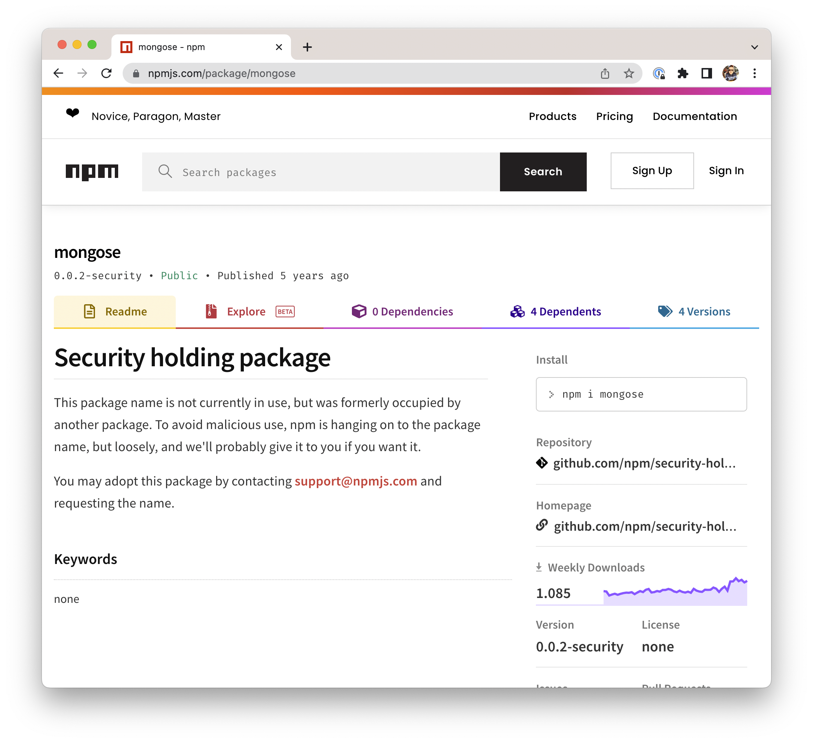
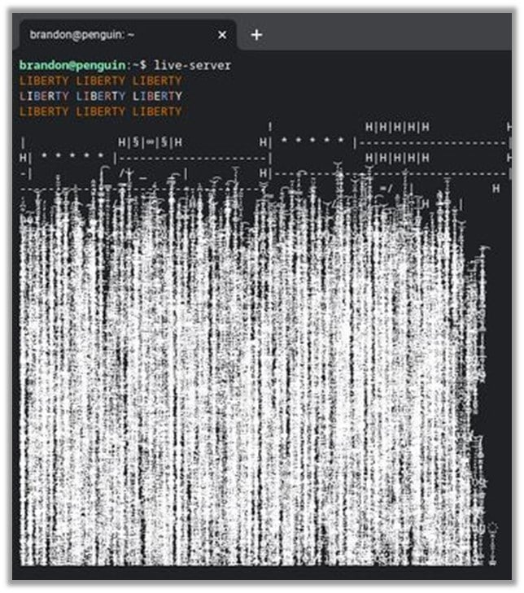
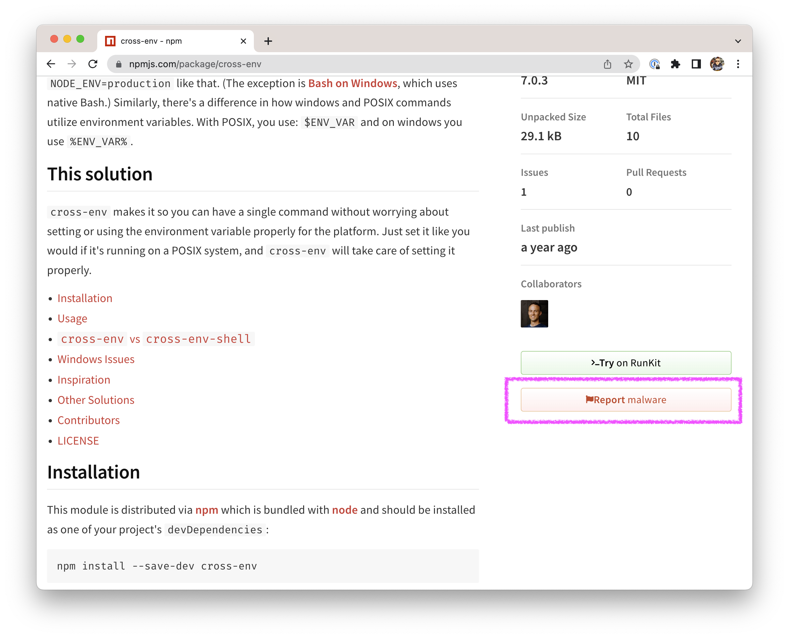

<!-- _class: lead -->
# 🛡️ NPM Security
## Security & Stability risks when working with node package manager(s).

---
<!-- _footer: Image courtesy of [Miguel Vasquez](https://twitter.com/Itsmiketheboxer/status/1370206031154868226/photo/1)-->
# Why tho?
- prevent build and production failures
- prevent system compromisation
- prevent leaking of secret information


---
<!-- _class: chapter -->
# 🧨 Attack Vectors 🪖

Most common attack vectors you’ll encounter are …
- Typosquatting
- Malicious Contributors
- Malicious Packages


---
# Typosquatting 🅰️

[Typosquatting](https://snyk.io/blog/typosquatting-attacks/) takes advantage of a developer unwillingly installing a package with a slightly different, mispelled name.

In monst cases those packages are similar to the original packages but include one or another malware or malicious code.

---
# Typosquatting Examples

```
npm install -
```

Would install the empty package [`-`](https://www.npmjs.com/package/-) which still has **26.000 Downloads** a week!

---
<!-- _header: image showing security placeholder on previously malicious packages -->
In most cases not harmfull as many packages have been disarmed by npm in the past. Some examples:

**mongoose** - mongose
**cross-env** - crossenv or crossenv.js
**lodash** - lodashs
**babel-cli** - babelcli

… some still have more than 1k downloads a week! (*Though they are empty!*)



---
# Compromised Contributors 👤

Some open source packages have many contributors that have access to publish npm packages. Some of these processes are automated using NPM tokens.

In case those accounts are hacked or tokens are leaked this opens up the possibility to manipulate the packages.

- **Protect your NPM Account with 2FA**
- **Protect your NPM Token in CI secrets**


---
<!-- _footer: unicode madness / endless loop from malicious colors package -->
# Malicious Contributors 😈

A package contributor decides willingly to break a package or inject malicious code. 

Example: marak [colors](https://www.npmjs.com/package/colors) and [faker](https://www.npmjs.com/package/faker) package 2022 (full story: [1](https://fossa.com/blog/npm-packages-colors-faker-corrupted/), [2](https://www.nbcnewyork.com/news/local/possible-bomb-making-materials-found-at-queens-home-after-fire-police-sources/2619627/))




---
<!-- _class: chapter -->
# Malicious Package? 🤔

A Malicous package can use at least two attack vectors injecting and executing code on behalf of the user or system.

---
# Abused Lifecycle Hooks ♻️

[npm lifecycle hooks](https://docs.npmjs.com/cli/v8/using-npm/scripts#life-cycle-scripts) (preinstall, postinstall) containing shell scripts or any kind of executable code.

- run in background (use: `--foreground-scripts`)
- executed with the permission of the user that ran `npm`
 
Everything is possible: Leak environment variables, configuration files, install malware, trojans, manipulate & delete files.

---
# Malicious Source File(s) 😡

**Every file that is included in a project can contain malicious parts!**

Those parts are not easy to get as the code is in most cases obfuscation, encoded and mangled.

Again – this opens abilities to leak environment variables, configuration files, install malware, trojans, manipulate & delete files.


---
# Demo: Malicious Package ⌨️

Install a package containing a `preinstall` shell script to show the current username in a OSX notification.

*see [examples/node-package-security-risks](examples/node-package-security-risks) directory*


---
<!-- _class: chapter -->
# Countermeasures 🤺
*We can do something! 💪*
- use `npm ci` (even on dev machines!)
- do not install packages for everything
- use packages with a certain age
- never edit `package.json` versions by hand

---
# 📌 pin versions

Use exact version (no semver-ranges) to make sure no undesired updated version is installed.

```
npm install --save-exact <package-name>
```
or make it the default behavior
```
npm config set save-exact true
```

*not recommended for library type of modules cause of package dublication*

---
# ignore scripts 🙈
    
```bash
npm ci --ignore-scripts
npm link --ignore-scripts <path>
npm install --ignore-scripts <package>
npm update --ignore-scripts <package>
```
or disabling scripts once and for all:
```
npm config set ignore-scripts true
```

Check if your project uses scripts at all with [`can-i-ignore-scripts`](https://www.npmjs.com/package/can-i-ignore-scripts)

---
# use [`npq`](https://www.npmjs.com/package/npq)
- runs several "marshals" before installing
- but still not 100% secure

Try it:
```
npx npq install cross-env.js
```


---
# report packages ✍️
Use the [Report Malware](https://docs.npmjs.com/reporting-malware-in-an-npm-package) Button



---
# Use package rating websites

Check packges on websites that collect additional information about packages like popularity, ratings, stars, update-frequency, downloads, number of issues and other kpis and metadata:

- https://snyk.io/advisor/npm-package
- https://openbase.com
- https://www.npmtrends.com


---
<!-- _class: chapter -->
# More to Read 📰

Most important thing is to be aware of security-related topics and not ignoring them.

- General Security
    - [What you need to know when installing packages](https://lirantal.medium.com/malicious-modules-what-you-need-to-know-when-installing-npm-packages-12b2f56d3685), [Account Takeover](https://www.whitesourcesoftware.com/resources/blog/npm-package-javascript-library-compromised-via-account-takeover/)
- Typosquatting
    - [Typosquatting Explained](https://snyk.io/blog/typosquatting-attacks/), [Attack undetected for 2 weeks](https://www.theregister.com/2017/08/02/typosquatting_npm/)
- Malicious Modules
    - [25 compromisde packages](https://thehackernews.com/2022/02/25-malicious-javascript-libraries.html), [discord packages](https://arstechnica.com/information-technology/2021/12/malicious-packages-sneaked-into-npm-repository-stole-discord-tokens/), [crypocurrency miner](https://app.renovatebot.com/package-diff?name=ua-parser-js&from=0.7.28&to=1.0.0), [Azure Developer Attack (jfrog)](https://jfrog.com/blog/large-scale-npm-attack-targets-azure-developers-with-malicious-packages/), [Malware Civil War (jfrog)](https://jfrog.com/blog/malware-civil-war-malicious-npm-packages-targeting-malware-authors/)

---
<!-- _class: invert -->
# Thanks for listening! 🐼
Please give feedback & ask questions!

